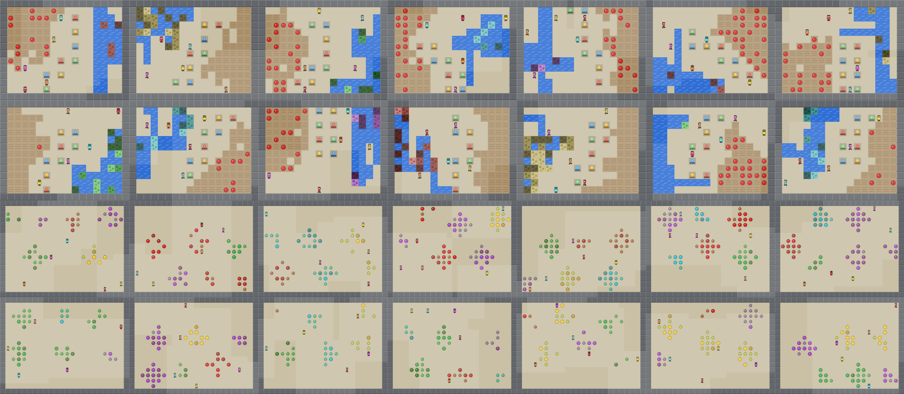
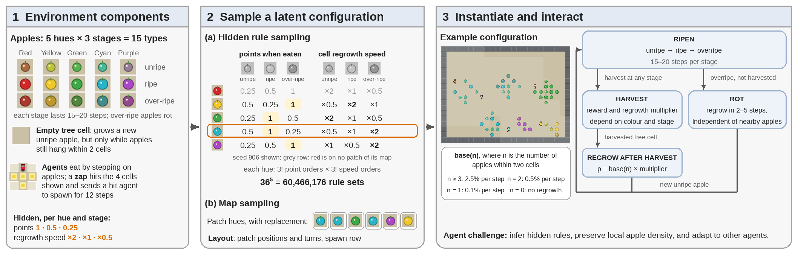

<h1 align="center">OpenSocialJax</h1>

*Two sequential social dilemmas with hidden rules to discover, in JAX, and a harness for LLM agents to play them.*

OpenSocialJax extends [SocialJax](https://arxiv.org/abs/2503.14576) (ICLR 2026) with two environments in
which the agents must work out how the world works while the social dilemma is in force, and with everything needed
to run language models as agents in them:

- **OpenCleanup** and **OpenHarvest** — Clean Up and Commons Harvest, each with a latent configuration (a hidden
  rule set, a map, colours) sampled per meta-episode from held-out splits.
- **An LLM-agent harness** — OpenAI-compatible endpoints, the Anthropic API, or a local vLLM server play an
  environment as a population of independent text agents; every run is recorded and resumable.
- **Experiment protocols** — homogeneous populations, mixed-model arenas, cooperator / defector Schelling diagrams
  and rule-reveal ablations, with the analysis scripts that turn runs into tables and figures.

<p align="center">
  
</p>

## The environments

<p align="center">
  
</p>

**OpenCleanup** (`open_cleanup`) is Clean Up with a crafting rule. The river carries waste of one hue in three
shades, and cleaning it needs a chain of three *working tools* (dark → mid → light → water). A working tool is an
ordered pair of pick-ups from four base-tool stations; *which* of the 16 ordered pairs make which tool is the hidden
rule, one of $P(16,7) = 57{,}657{,}600$ rule sets. Apples grow only while the river is clean enough, so cleaning is a
public good that some agents must provide while every apple pays only its eater.

**OpenHarvest** (`open_harvest`) is Commons Harvest with ripeness. Apples are unripe, ripe or over-ripe and then rot.
For every hue, the points an apple pays at each stage (an order of 1 / 0.5 / 0.25) and how fast its cell regrows
when harvested at each stage (an order of ×2 / ×1 / ×0.5) are hidden, one of $36^5 = 60{,}466{,}176$ rule sets. A cell
regrows only while apples still hang near it, so restraint preserves a common pool that any agent can deplete.

In both, a meta-episode is several trials on one configuration: the map, the rules and the colours stay fixed, the
world is re-laid at every trial, and the agents keep what they learned. Rewards are individual. Rule spaces are
enumerated in [`discovery_rules.py`](opensocialjax/environments/discovery_rules.py), split into train / held-out
benchmarks in [`rule_benchmark.py`](opensocialjax/environments/rule_benchmark.py), and served by
[`held_out.py`](opensocialjax/environments/held_out.py); maps come from the pools in each environment's `layouts*.py`.

## Installation

Python 3.10. Everything runs from the repository root with the root on `PYTHONPATH`.

```bash
git clone <this repository> OpenSocialJax
cd OpenSocialJax
conda env create -f environment.yml          # or: conda create -n OpenSocialJax python=3.10 && pip install -r requirements.txt
conda activate OpenSocialJax
export PYTHONPATH=$PWD:$PYTHONPATH
python -m pytest tests -q                    # environment tests (CPU is fine: JAX_PLATFORMS=cpu)
```

`requirements.txt` pins JAX 0.6.2 with CUDA 12 wheels; on a CPU-only machine install `jax==0.6.2` instead.

## Using the environments

The interface follows [JaxMARL](https://github.com/FLAIROx/JaxMARL/) (PettingZoo / Gymnax style): `reset(key)` and
`step(key, state, actions)` are jitted and return per-agent dictionaries.

```python
import jax
import opensocialjax
from opensocialjax.environments.held_out import held_out_env, held_out_harvest_env

env = held_out_env(num_agents=5)               # OpenCleanup: rules from the held-out split, river fully polluted at the start
env = held_out_harvest_env(num_agents=5)       # OpenHarvest
env = opensocialjax.make("open_harvest", num_agents=5, num_inner_steps=300, num_outer_steps=5)   # the raw constructor

key = jax.random.PRNGKey(0)
obs, state = env.reset(key)
actions = [env.action_space(i).sample(jax.random.fold_in(key, i)) for i in range(env.num_agents)]
obs, state, reward, done, info = env.step(key, state, actions)
```

`num_inner_steps` is the length of a trial and `num_outer_steps` the number of trials in a meta-episode. The
constructors' docstrings list the rest (rule pools, map pools, ripening and regrowth parameters, the zap freeze).

## LLM agents

[`llm_policy/`](llm_policy) plays both environments with language models. Each agent is an independent model
instance. Every step it receives a text observation — an egocentric 11 × 11 window, the legal actions, a ledger of
what the environment's own feedback proved to it, and a notebook it edits itself — and replies with one JSON object.
The prompt states the rules of the world, never the hidden rule set and never tactics; agents cannot communicate and
are not told which model controls the others. How the observation is built, what the ledger and the notebook hold,
and what a run writes are described in [`llm_policy/README.md`](llm_policy/README.md).

### Configuring an experiment

An experiment is a folder under `experiments/` with a `config.json`. The eight folders shipped here are the
settings of the paper; copy one to start your own. A config has three parts:

```json
{
  "name": "open_harvest_5ag",
  "game": "harvest",
  "setting": { ... },          // the environment and the protocol, shared by every model
  "models":  { ... }           // one entry per model: how to call it and how it decodes
}
```

**`setting`** (`game` is `"cleanup"` or `"harvest"`):

| key | meaning |
|---|---|
| `agents`, `inner`, `outer` | agents per population, steps per trial, trials per meta-episode (400 × 5 for OpenCleanup, 300 × 5 for OpenHarvest in the paper) |
| `seeds` | the problems: a seed fixes the map, the hidden rules and the colours, so every model faces the same ones |
| `history` | how many recent steps the observation shows (15) |
| `max_tokens` | default reply budget; a model's own `max_tokens` overrides it |
| `reward` | must be `"individual"`; a config that says `"common"` is refused |
| OpenCleanup: `random_layout`, `skew`, `spawn`, `tools` | a held-out map per seed; one waste hue per meta-episode (`skew: 1.0`); waste re-appearance probability; `"shared"` tool structure |
| OpenHarvest: `pool`, `respawn_wait`, `ripen_range`, `rot_range`, `rates`, `early_stop` | the map pool (`"orig6"`); steps a zapped agent is frozen; steps per ripeness stage; regrowth delay of a rotted cell; the regrowth multipliers; fast-forward once the orchard is dead |
| `reveal_orders` (OpenCleanup) / `reveal_rules`, `reveal_regrowth` (OpenHarvest) | the rule-reveal ablation: hand every agent the hidden rules at the start |
| `stop_after_trials` | end every run after its first *k* trials while keeping the prompt of the full run |

**`models`**: every entry has a `kind` and the keys of that kind, plus optional keys any kind accepts.

```json
"gpt-6-luna": {
  "kind": "api", "model": "gpt-6-luna",
  "base_url": "https://api.openai.com/v1", "key_file": "~/.config/openai/key",
  "schema_mode": "json_schema", "token_param": "max_completion_tokens", "max_tokens": 32000,
  "price": {"input": 0.25, "cached": 0.025, "output": 2.0}
},
"claude-opus-5.5": {
  "kind": "anthropic", "model": "claude-opus-5-5", "key_file": "~/.config/anthropic/key",
  "effort": "medium", "max_tokens": 16000,
  "price": {"input": 4.0, "cached": 0.2, "output": 20.0, "cache_write": 5.0, "input_includes_cached": false}
},
"deepseek-v4.1-flash-nothink": {
  "kind": "api", "model": "deepseek-flash", "base_url": "https://api.deepseek.com/v1", "key_file": "~/.config/deepseek/key",
  "schema_mode": "json_object", "reasoning_effort": "none", "temperature": 0.2, "max_tokens": 32000,
  "offpeak_only": true, "peak_utc": [[1, 4], [6, 10]]
},
"qwen3.8-27b": {
  "kind": "vllm", "model_dir": "models/Qwen3.8-27B", "venv": "~/venvs/vllm", "gpus": 2, "serve": "legacy",
  "vllm_extra": "--reasoning-parser qwen3 --tensor-parallel-size 2",
  "think_effort": "medium", "temperature": 0.2, "max_tokens": 6000
}
```

| `kind` | keys | notes |
|---|---|---|
| `api` — any OpenAI-compatible chat endpoint | `model`, `base_url`, `key_file`; `schema_mode` (`json_schema` = strict structured output, `json_object`, or `none` when the endpoint supports neither); `token_param` (`max_tokens`, or `max_completion_tokens` for OpenAI reasoning models); `reasoning_effort`; `temperature`; `extra_body` | reasoning models take no `temperature`; leave it out to use the provider's default |
| `anthropic` — the Anthropic API | `model`, `key_file`, `effort` (`low` / `medium` / `high`) | replies are parsed as JSON without structured output |
| `vllm` — a local open-weight model | `model_dir`, `venv` (the Python environment with vLLM), `gpus`, `serve` (`legacy`, or `open` for a vLLM 0.29 build that needs the cache variables), `vllm_extra` (extra `vllm serve` flags: reasoning parser, tensor parallelism, speculative decoding, ...); `think_effort` (models with effort levels), `think_budget` (a hard cap on thinking tokens for models without them; the harness closes the think block and asks for the answer), `temperature`, `sampling` (any extra sampling parameters, e.g. `{"top_p": 0.95, "top_k": 20, "presence_penalty": 1.5}`) | the SLURM launcher starts the server; to use one you started yourself, pass `--base-url http://host:port/v1` to the runner |
| `scripted` | — | a fixed policy, for smoke tests without any model |

Optional keys for any kind: `max_tokens` (this model's reply budget), `price` (dollars per million tokens: `input`,
`cached`, `output`, `cache_write`; set `input_includes_cached: false` when the provider reports cached tokens
separately — the cost lands in `result.json`), `seeds` (this model's own seed list, e.g. `[906, 907, "906r1"]`: the
replicate `906r1` replays seed 906's problem under other run randomness), `time` (SLURM wall time), `paused`
(hold a model: `--submit` and `--watch` skip it), `offpeak_only` + `peak_utc` (pause live calls in the provider's
peak-price hours), and free-text notes such as `thinking` for the record.

Keys are plain text files; a `key_file` holds one key and nothing else. Nothing in the repository reads keys from
the environment.

### Running

```bash
# one (model, seed) here; interrupted runs resume from their recorded replies
python llm_policy/run_experiment.py --exp experiments/open_harvest_5ag --model gpt-6-luna --seed 906
python llm_policy/run_experiment.py --exp experiments/open_harvest_5ag --status

# on SLURM: one job per unfinished (model, seed), and a watchdog that resubmits until every run is DONE
export SLURM_ACCOUNT=<account>            # if your queue needs one; CONDA_SH / CONDA_ENV if conda lives elsewhere
python llm_policy/run_experiment.py --exp experiments/open_harvest_5ag --model qwen3.8-27b --submit
python llm_policy/run_experiment.py --exp experiments/open_harvest_5ag --watch
```

A run is written to `experiments/<exp>/runs/<model>/seed<k>/`: `calls_agent<i>.jsonl` (every reply, as it arrives),
`decisions.jsonl` (prompt, reply and outcome of every step), `progress.json`, `result.json` (scores per trial and per
agent, notebook statistics, token usage, cost) and `DONE`. `runs/` is not tracked.

**Protocols.** The same config format drives three runners:

| runner | experiment folders | what it does |
|---|---|---|
| `run_experiment.py` | `open_cleanup_5ag`, `open_harvest_5ag`, `open_cleanup_reveal`, `open_harvest_reveal` | homogeneous populations: every seat is the same model, one run per (model, seed); the `*_reveal` configs add `reveal_*` and `stop_after_trials` |
| `run_arena.py` | `open_cleanup_arena`, `open_harvest_arena` | `roster`: five models in one population, one per seat, seating rotated per seed; tokens and cost booked per model |
| `run_schelling.py` | `open_cleanup_schelling`, `open_harvest_schelling` | one model (`model`) in every seat; for each *k* in `compositions`, *k* agents are prompted as cooperators and the rest as defectors (`ROLES` in the prompt modules) |

```bash
python llm_policy/run_arena.py     --exp experiments/open_harvest_arena     --seed 906     # or --submit / --status / --watch
python llm_policy/run_schelling.py --exp experiments/open_harvest_schelling --k 3 --seed 906
```

### Analysis

[`scripts/`](scripts) turns finished runs into the paper's tables and figures: `summarize_open_cleanup.py` and
`summarize_open_harvest.py` (per-model tables), `open_harvest_bounds.py <seed>` (the scripted greedy and oracle
references a seed's score is placed between), `make_results_figures.py`, `make_schelling_figures.py --trials 5` and
`open_harvest_notes_timeline.py`. See [`scripts/README.md`](scripts/README.md).

## Repository layout

```
opensocialjax/          the two environments, the rule spaces and their held-out splits, JaxMARL-style wrappers
llm_policy/             the LLM-agent harness: prompts, policies, providers, the three runners
experiments/            the experiment configs of the paper (and OpenHarvest's scripted reference bounds)
scripts/                analysis and figure scripts; scripts/slurm/ launchers for API and vLLM runs
tests/                  environment tests, and the scripted OpenHarvest policies used as references
docs/                   the figures used here
```

## Citation

This repository accompanies a paper under double-blind review; the citation will be added once the review is over.
The environments and the JAX infrastructure build on [SocialJax](https://arxiv.org/abs/2503.14576) (ICLR 2026).
