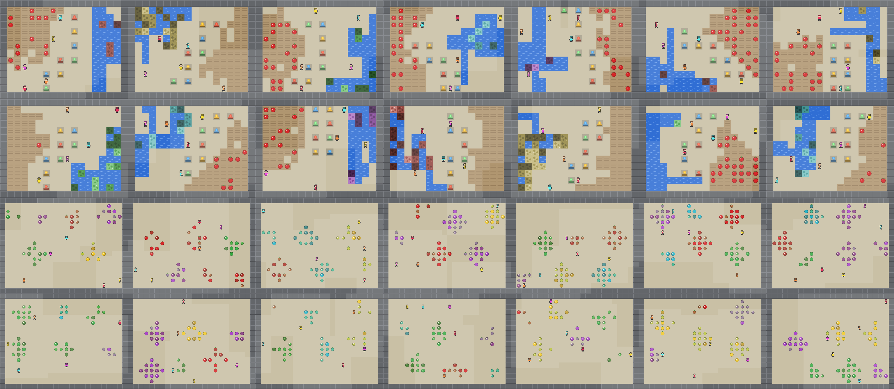
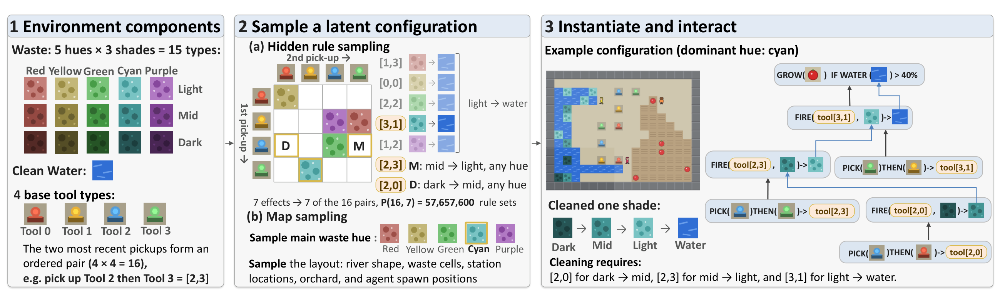
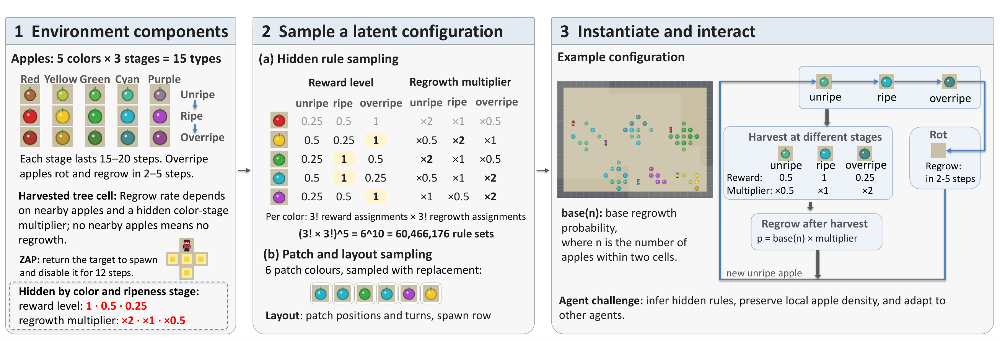

<h1 align="center">OpenSocialJax</h1>

*Two sequential social dilemmas with hidden rules to discover, in JAX, and a harness for LLM agents to play them.*


- **OpenCleanup** and **OpenHarvest** — Clean Up and Commons Harvest, each with a latent configuration (a hidden
  rule set, a map, colours) sampled per meta-episode from held-out splits.
- **An LLM-agent harness** — OpenAI-compatible endpoints, the Anthropic API, or a local vLLM server play an
  environment as a population of independent text agents; every run is recorded and resumable.
- **Experiment protocols** — homogeneous populations, mixed-model arenas, cooperator / defector Schelling diagrams
  and rule-reveal ablations, with the analysis scripts that turn runs into tables and figures.

<p align="center">
  
</p>

Every command below was run as written, on an environment built from `environment.yml`, on a CPU node.

## 1. Install

Python 3.10.

```bash
git clone <this repository> OpenSocialJax && cd OpenSocialJax
conda env create -f environment.yml      # creates the env "OpenSocialJax" and installs the package into it
conda activate OpenSocialJax
python -m pytest tests -q                # 31 tests, a few minutes on a CPU
```

Without conda: `pip install -r requirements.txt -e .` in a Python 3.10 environment. The JAX wheels are the CUDA 12
build; a machine without a GPU runs everything on the CPU (the tests and the harness are quiet about it, a plain
`import jax` reports the missing CUDA device once).

## 2. Step an environment

```python
import jax, numpy as np
from PIL import Image
from opensocialjax.environments.held_out import held_out_env, held_out_harvest_env

env = held_out_harvest_env(num_agents=5, num_inner_steps=300, num_outer_steps=5)   # OpenHarvest, held-out rules
# env = held_out_env(num_agents=5)                                                  # OpenCleanup
key = jax.random.PRNGKey(0)
obs, state = env.reset(key)                       # obs[i]: agent i's 11 x 11 egocentric window, one channel per item
for t in range(20):
    key, k = jax.random.split(key)
    actions = [env.action_space(i).sample(jax.random.fold_in(k, i)) for i in range(env.num_agents)]
    obs, state, reward, done, info = env.step(k, state, actions)      # reward[i]: agent i's own reward this step
Image.fromarray(np.asarray(env.render(state)).astype(np.uint8)).save("open_harvest.png")
```

The interface follows [JaxMARL](https://github.com/FLAIROx/JaxMARL/): `reset` and `step` are jitted and return
per-agent dictionaries. `num_inner_steps` is the length of a trial, `num_outer_steps` the number of trials in a
meta-episode; the environment re-lays the world at every trial boundary and `done["__all__"]` turns true after the
last trial. Actions: 0–3 move north / south / east / west, 4–5 turn, 6 zap (OpenHarvest) or fire (OpenCleanup),
7 stay, and 8 pick up in OpenCleanup. `held_out_*` draws the hidden rules from the held-out split of the rule
benchmark; `opensocialjax.make("open_harvest", ...)` / `make("open_cleanup", ...)` are the raw constructors.

Both environments are pure JAX, so many copies step in lockstep under `jax.vmap`; the speed test measures that with
random actions on the default device (the GPU when there is one):

```bash
python speed_test/speed_test_random.py                      # both environments, 1 / 128 / 1024 parallel copies
python speed_test/speed_test_random.py --env open_harvest --num-envs 4096
```

On one Hopper-class GPU, 4096 copies step at about 7 million environment steps per second in OpenCleanup and
11 million in OpenHarvest (five agents each; compilation excluded).

## 3. Run LLM agents

### A two-minute run, no model needed

`experiments/demo` is a two-trial, 40-step OpenCleanup experiment. Its `scripted` model is a fixed policy (walk, pick
up, fire), so the whole pipeline runs without any API key:

```bash
python llm_policy/run_experiment.py --exp experiments/demo --model scripted --seed 906
```

```
[scripted seed 906] start; recorded replies per agent [0, 0, 0, 0, 0] -> replaying those, then live
[scripted seed 906] DONE team apples/trial [0, 0] | cost $None | 405 calls
```

About 20 seconds. The scripted policy never works out the recipe, so it eats nothing; the point is the plumbing. The
run is in `experiments/demo/runs/scripted/seed906/`: `calls_agent<i>.jsonl` (every reply of agent *i*),
`decisions.jsonl` (the prompt, reply and outcome of every step), `system.txt`, `result.json` (scores, token usage,
cost) and `DONE`.

```bash
python llm_policy/run_experiment.py --exp experiments/demo --status               # where every run stands
python scripts/render_run.py experiments/demo/runs/scripted/seed906 --trials 1,2  # one GIF per trial, in <run>/gifs/
```

**Runs resume.** Interrupt a run (Ctrl-C, a lost connection, a job limit) and start the same command again: the
recorded replies are replayed without a model call, which rebuilds the world, the ledgers and the notebooks exactly,
and the run carries on live from the first unrecorded step. The first line then reads
`recorded replies per agent [n, n, n, n, n]`.

### With a language model

A model is an entry under `"models"` in the experiment's `config.json`; `experiments/demo` already declares
`gpt-6-luna` (an OpenAI-compatible endpoint, key read from `~/.config/openai/key`). Put your key in that file and run:

```bash
mkdir -p ~/.config/openai && echo "sk-..." > ~/.config/openai/key && chmod 600 ~/.config/openai/key
python llm_policy/run_experiment.py --exp experiments/demo --model gpt-6-luna --seed 906
```

The demo's 405 calls took about ten minutes and cost $0.17 with gpt-6-luna (the five agents are queried in parallel).
In two 40-step trials the team cleared 20 waste cells and ate no apples: the river takes longer than that to clean,
which is why the paper's trials are 400 steps. Every step each agent replies with one JSON object — why, a mode,
a goal, one notebook edit, the action; agent A at step 5 of the first trial:

```json
{
  "why_this_move": "I am standing on T1 with window [2]; picking up tool 1 tests the ordered pair [2,1], which may make a working tool. I have not seen waste yet, so I will explore this combination before heading to the river.",
  "mode": "explore",
  "goal": {
    "type": "pick_up",
    "cell": [7, 10],
    "why": "test the pick-up order [2,1]"
  },
  "note": {
    "op": "none",
    "id": 0,
    "text": ""
  },
  "action": 8
}
```

To use another model, copy the entry and change the fields: `kind: api` for any OpenAI-compatible endpoint,
`kind: anthropic` for the Anthropic API, `kind: vllm` for a local open-weight model served with vLLM. Every key is
described in [docs/configuration.md](docs/configuration.md).

### On a SLURM cluster

One job per unfinished (model, seed), and a watchdog that resubmits until everything is `DONE`; for `kind: vllm`
models the job starts the vLLM server first.

```bash
export SLURM_ACCOUNT=<account>      # if your queue needs one; CONDA_SH / CONDA_ENV if conda is not in ~/miniconda3
python llm_policy/run_experiment.py --exp experiments/demo --model gpt-6-luna --submit
python llm_policy/run_experiment.py --exp experiments/demo --watch
```

## 4. Reproduce the paper's experiments

The eight folders under `experiments/` are the paper's settings, including every model's decoding spec. Seeds 906,
907 and 908 fix the map, the hidden rules and the colours, so every model faces the same three problems. `runs/` are
not shipped.

| experiment | runner | what it is |
|---|---|---|
| `open_cleanup_5ag`, `open_harvest_5ag` | `run_experiment.py` | homogeneous populations: five copies of one model, 8 models × 3 seeds |
| `open_cleanup_arena`, `open_harvest_arena` | `run_arena.py` | five different models in one population, seating rotated per seed |
| `open_cleanup_schelling`, `open_harvest_schelling` | `run_schelling.py` | gpt-6-luna in every seat, *k* = 0…5 of them prompted as cooperators, the rest as defectors |
| `open_cleanup_reveal`, `open_harvest_reveal` | `run_experiment.py` | the hidden rules given to every agent at the start, first trial only |

```bash
# homogeneous populations: one run per (model, seed); each model needs its key file (or GPUs for vLLM models)
python llm_policy/run_experiment.py --exp experiments/open_harvest_5ag --model gpt-6-luna --seed 906
python llm_policy/run_experiment.py --exp experiments/open_harvest_5ag --model gpt-6-luna --submit    # all seeds as jobs
python llm_policy/run_experiment.py --exp experiments/open_harvest_5ag --status

# arena and Schelling
python llm_policy/run_arena.py     --exp experiments/open_harvest_arena     --seed 906
python llm_policy/run_schelling.py --exp experiments/open_harvest_schelling --k 3 --seed 906
python llm_policy/run_schelling.py --exp experiments/open_harvest_schelling --submit                  # all 18 runs
```

One OpenCleanup seed is 5 trials × 400 steps × 5 agents, about 10k calls: in the paper's runs it cost about $4 with
gpt-6-luna, $7 with GLM-5.3-Flash, $70 with gpt-6-sol and $220 with Claude Opus 5.5; an OpenHarvest seed is roughly a
quarter of that, since a trial ends once the orchard is dead. Local models (Qwen3.8-27B, Gemma 4 31B, Qwen3.5-4B)
need 1–2 GPUs: put the weights at `models/<name>` and vLLM in the venv the spec names.

## 5. Your own experiment

```bash
cp -r experiments/open_harvest_5ag experiments/my_harvest      # then edit experiments/my_harvest/config.json
```

Change `setting.seeds` (a new seed draws a new map, rule set and colours), `setting.inner` / `outer`, and keep only
the `models` you have keys for. `setting.reveal_rules: true` (OpenHarvest) or `reveal_orders: true` (OpenCleanup)
gives every agent the hidden rules; `stop_after_trials: 1` ends runs after the first trial. For a population of
different models start from `open_harvest_arena` (edit `roster`); for cooperator / defector roles start from
`open_harvest_schelling` (edit `model`, `compositions`). Run it exactly like the shipped ones.

## The environments

<p align="center">
  
</p>

**OpenCleanup** (`open_cleanup`) is Clean Up with a crafting rule. The river carries waste of one hue in three
shades, and cleaning it needs a chain of three *working tools* (dark → mid → light → water). A working tool is an
ordered pair of pick-ups from four base-tool stations; *which* of the 16 ordered pairs make which tool is the hidden
rule, one of $P(16,7) = 57{,}657{,}600$ rule sets. Apples grow only while the river is clean enough, so cleaning is a
public good that some agents must provide while every apple pays only its eater.

<p align="center">
  
</p>

**OpenHarvest** (`open_harvest`) is Commons Harvest with ripeness. Apples are unripe, ripe or over-ripe and then rot.
For every hue, the points an apple pays at each stage (an order of 1 / 0.5 / 0.25) and how fast its cell regrows
when harvested at each stage (an order of ×2 / ×1 / ×0.5) are hidden, one of $36^5 = 60{,}466{,}176$ rule sets. A cell
regrows only while apples still hang near it, so restraint preserves a common pool that any agent can deplete.

In both, a meta-episode is several trials on one configuration: the map, the rules and the colours stay fixed, the
world is re-laid at every trial, and the agents keep what they learned. Rewards are individual. Each LLM agent sees
an egocentric 11 × 11 window, the legal actions, a ledger of what the environment's own feedback proved to it, and a
notebook it edits itself; the prompt states the rules of the world, never the hidden rule set and never tactics, and
agents cannot communicate.

## Repository layout

```
opensocialjax/     the two environments, the rule spaces and their held-out splits (held_out.py), wrappers
llm_policy/        the LLM-agent harness: prompts, policies, providers, the three runners
experiments/       the paper's experiment configs and the demo
scripts/           render_run.py (a finished run to GIFs); scripts/slurm/ launchers for API and vLLM runs
tests/             environment tests, and the scripted OpenHarvest policies used as references
speed_test/        random-action throughput of the environments
docs/              configuration.md and the figures above
```

